

<!-- PROJECT LOGO -->

<a href="https://www.instagram.com/cosmo_art0/">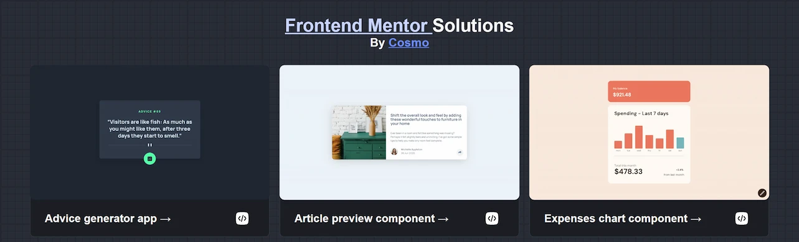</a>
 
 

  # Frontend Mentor Solutions by Cosmo

  A collection of my solutions to the challenges on [Frontend Mentor](https://www.frontendmentor.io/).

  <a href="https://frontend-solutions.netlify.app">View Demo</a>
  ·
  <a href="https://github.com/cosmoart/frontend-challenges/issues">Report Bug</a>
  ·
  <a href="https://github.com/cosmoart/frontend-challenges/issues">Request Feature</a>

<!-- TABLE OF CONTENTS -->

Table of contents

- [About The Project](#about-the-project)
- [Screenshots](#screenshots)
- [Solutions](#solutions)
- [License](#license)
- [Contact](#contact)

<!-- ABOUT THE PROJECT -->
## About The Project

A collection of my solutions to the challenges on [Frontend Mentor](https://www.frontendmentor.io/).

<a href="#top">⬆ Back to top</a>

<!-- SCREENSHOTS -->
## Screenshots

<table>
    <tr>
      <td>
          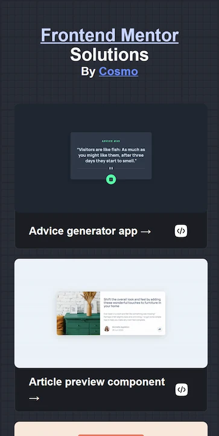
      </td>
      <td>
          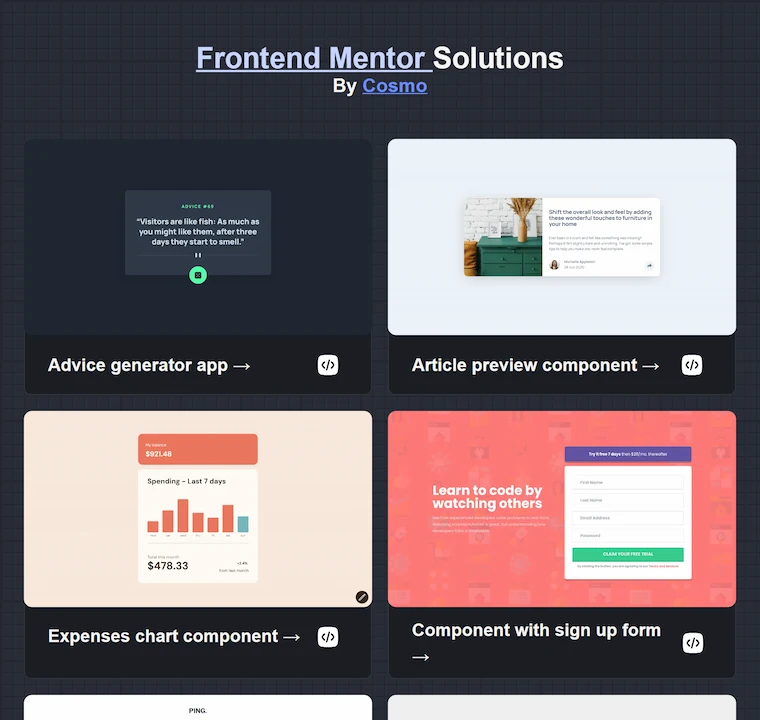
      </td>
      <td>
          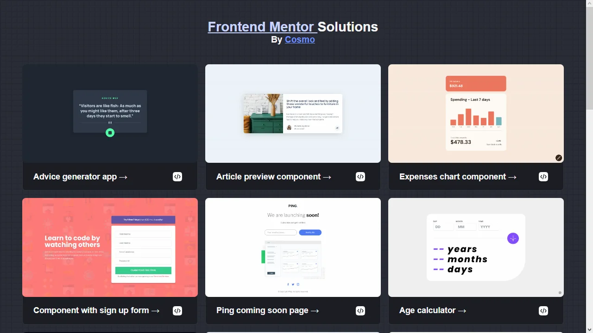
      </td>
    </tr>
</table>

<a href="#top">⬆ Back to top</a>

### Solutions

<table>
<tr>
				<td>
								<a href=https://github.com/cosmoart/frontend-challenges/tree/main/src/components/advice-generator-app target="_blank" rel="noopener noreferrer">
												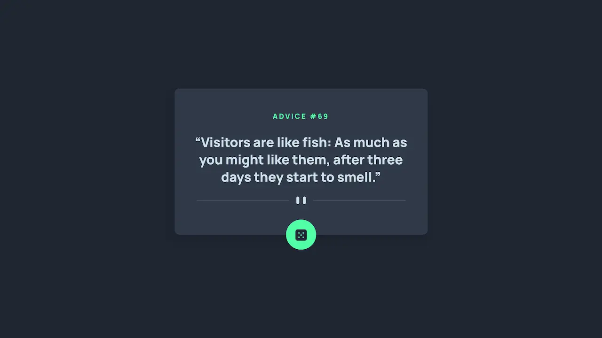
												Advice generator app
								</a>
				</td>
				<td>
								<a href=https://github.com/cosmoart/frontend-challenges/tree/main/src/components/article-preview-component target="_blank" rel="noopener noreferrer">
												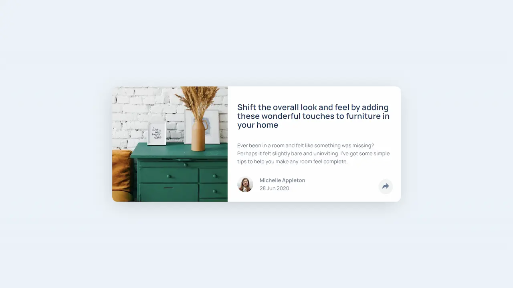
												Article preview component
								</a>
				</td>
				<td>
								<a href=https://github.com/cosmoart/frontend-challenges/tree/main/src/components/expenses-chart-component target="_blank" rel="noopener noreferrer">
												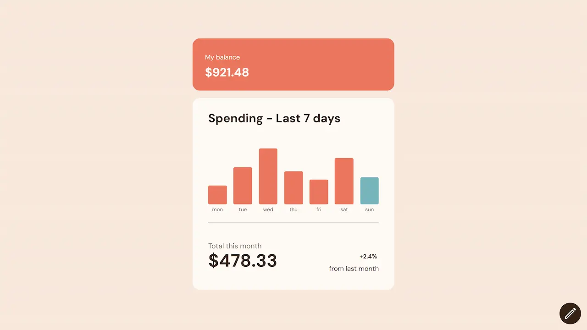
												Expenses chart component
								</a>
				</td>
</tr>

<tr>
				<td>
								<a href=https://github.com/cosmoart/frontend-challenges/tree/main/src/components/intro-component-with-sign-up-form target="_blank" rel="noopener noreferrer">
												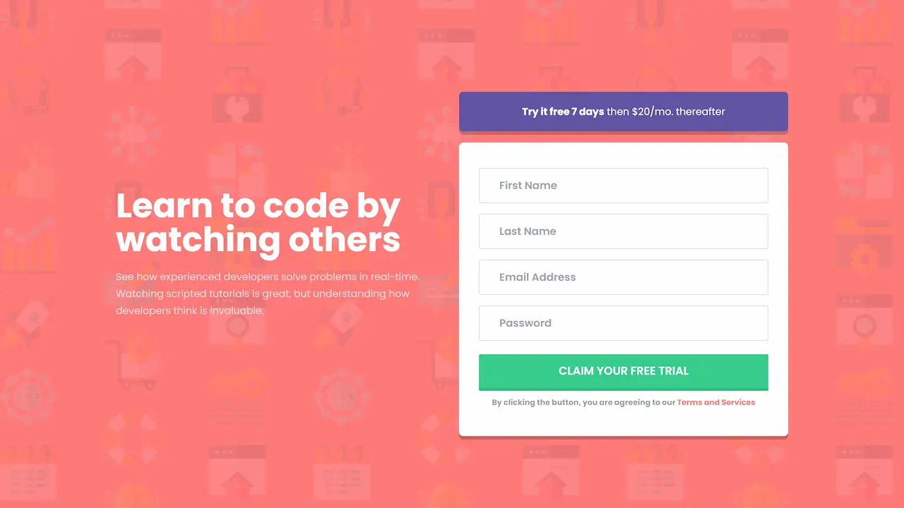
												Component with sign up form
								</a>
				</td>
				<td>
								<a href=https://github.com/cosmoart/frontend-challenges/tree/main/src/components/ping-coming-soon-page target="_blank" rel="noopener noreferrer">
												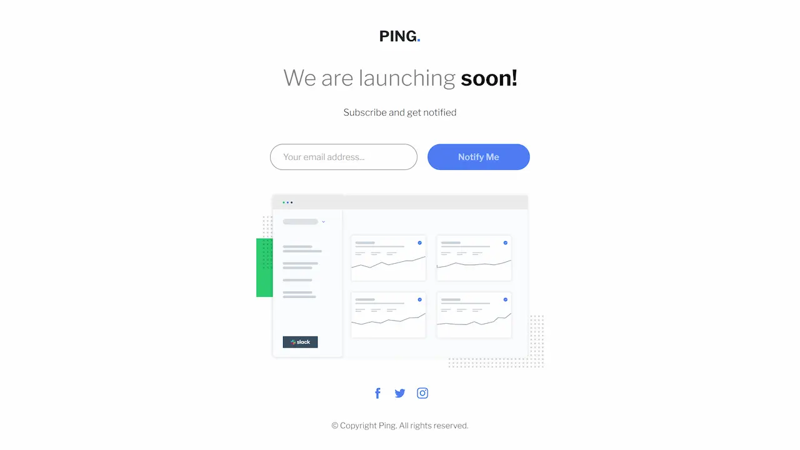
												Ping coming soon page
								</a>
				</td>
				<td>
								<a href=https://github.com/cosmoart/frontend-challenges/tree/main/src/components/age-calculator target="_blank" rel="noopener noreferrer">
												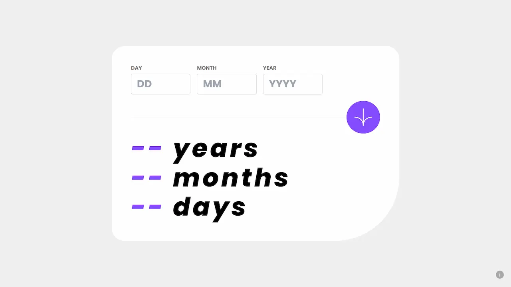
												Age calculator
								</a>
				</td>
</tr>

<tr>
				<td>
								<a href=https://github.com/cosmoart/frontend-challenges/blob/main/src/pages/project/stats-preview-card.html target="_blank" rel="noopener noreferrer">
												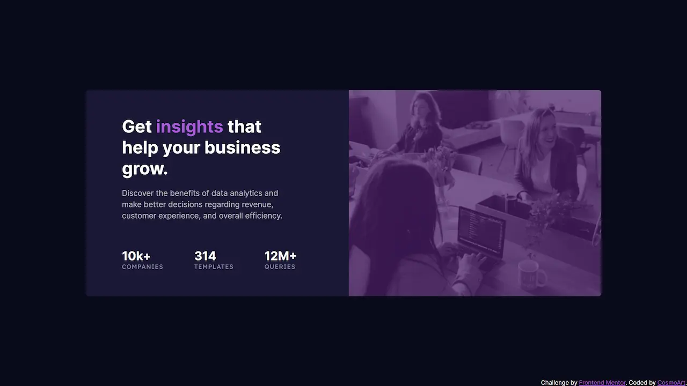
												Stats preview card
								</a>
				</td>
				<td>
								<a href=https://github.com/cosmoart/frontend-challenges/blob/main/src/pages/project/single-price-grid.html target="_blank" rel="noopener noreferrer">
												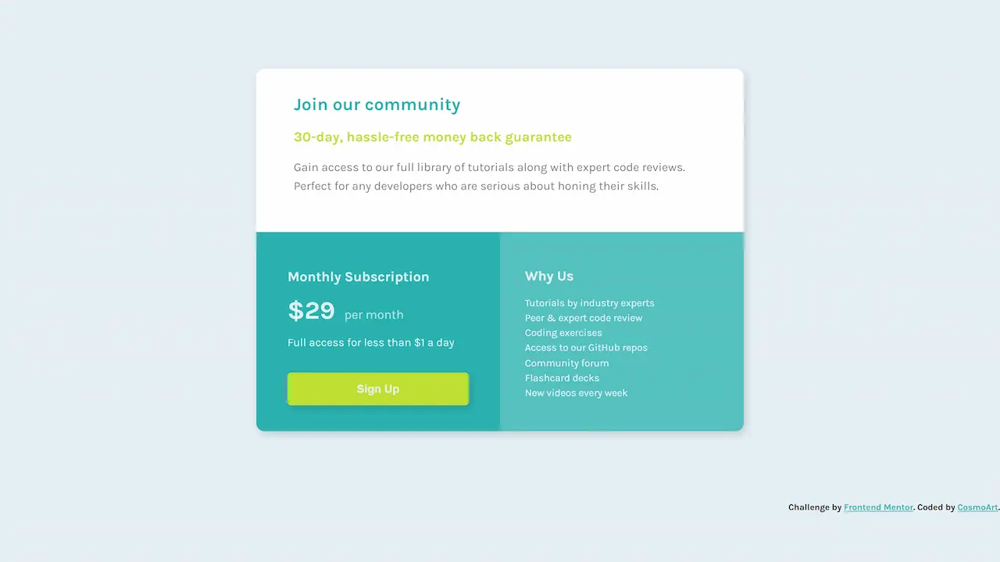
												Single price grid
								</a>
				</td>
				<td>
								<a href=https://github.com/cosmoart/frontend-challenges/blob/main/src/pages/project/four-card-feature-section.html target="_blank" rel="noopener noreferrer">
												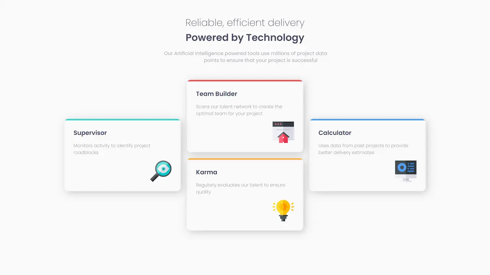
												Four card feature section
								</a>
				</td>
</tr>

<tr>
				<td>
								<a href=https://github.com/cosmoart/frontend-challenges/blob/main/src/pages/project/huddle-landing-page.html target="_blank" rel="noopener noreferrer">
												
												Huddle landing page
								</a>
				</td>
				<td>
								<a href=https://github.com/cosmoart/frontend-challenges/blob/main/src/pages/project/3-column-preview-card.html target="_blank" rel="noopener noreferrer">
												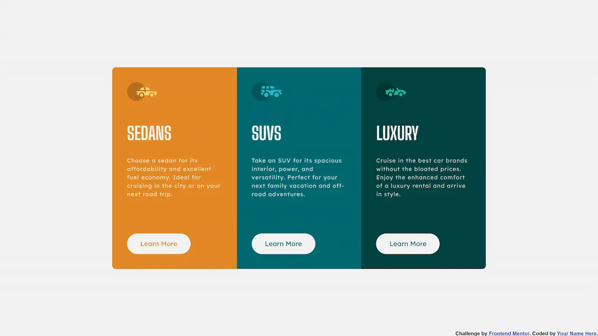
												3 column preview card
								</a>
				</td>
				<td>
								<a href=https://github.com/cosmoart/frontend-challenges/blob/main/src/pages/project/fylo-data-storage.html target="_blank" rel="noopener noreferrer">
												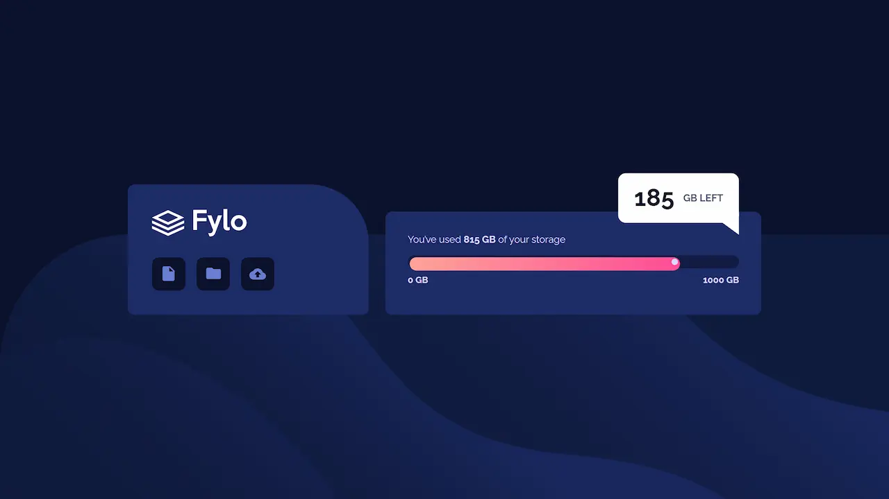
												Fylo data storage
								</a>
				</td>
</tr>

<tr>
				<td>
								<a href=https://github.com/cosmoart/frontend-challenges/blob/main/src/pages/project/social-proof-section.html target="_blank" rel="noopener noreferrer">
												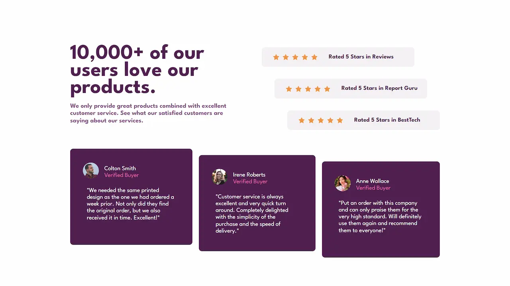
												Social proof section
								</a>
				</td>
				<td>
								<a href=https://github.com/cosmoart/frontend-challenges/blob/main/src/pages/project/testimonials-grid-section.html target="_blank" rel="noopener noreferrer">
												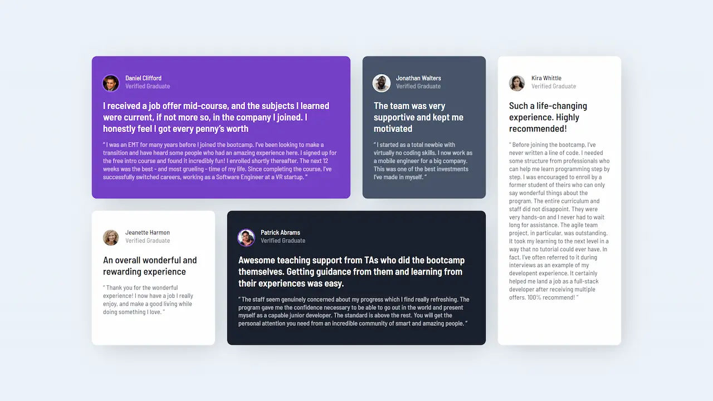
												Testimonials grid section
								</a>
				</td>
				<td>
								<a href=https://github.com/cosmoart/frontend-challenges/blob/main/src/pages/project/interactive-rating.html target="_blank" rel="noopener noreferrer">
												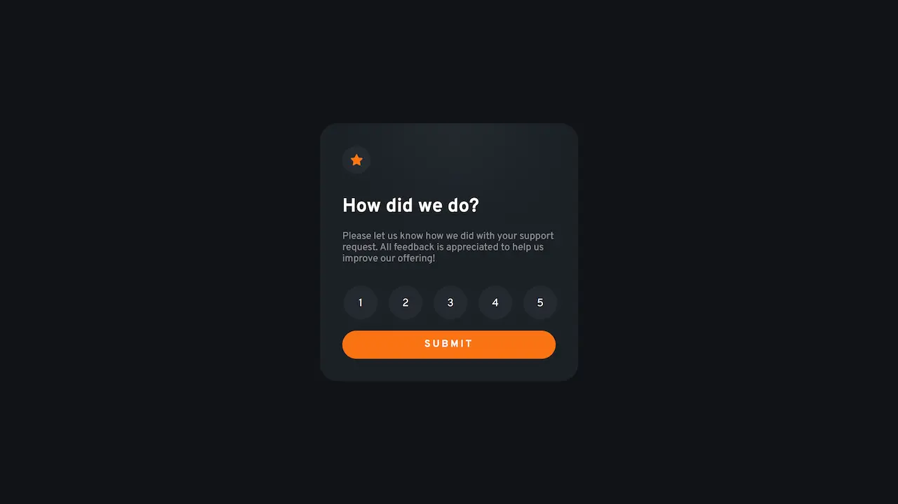
												Interactive rating component
								</a>
				</td>
</tr>

<tr>
				<td>
								<a href=https://github.com/cosmoart/frontend-challenges/blob/main/src/pages/project/product-preview-card.html target="_blank" rel="noopener noreferrer">
												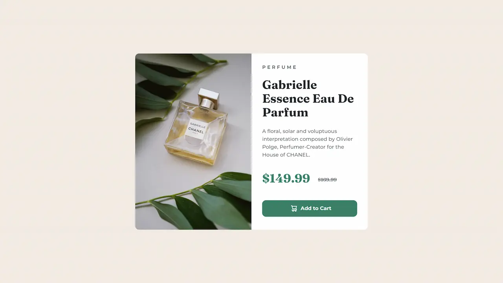
												Product preview card
								</a>
				</td>
				<td>
								<a href=https://github.com/cosmoart/frontend-challenges/blob/main/src/pages/project/coming-soon-page.html target="_blank" rel="noopener noreferrer">
												
												Coming soon page
								</a>
				</td>
				<td>
								<a href=https://github.com/cosmoart/frontend-challenges/blob/main/src/pages/project/order-summary.html target="_blank" rel="noopener noreferrer">
												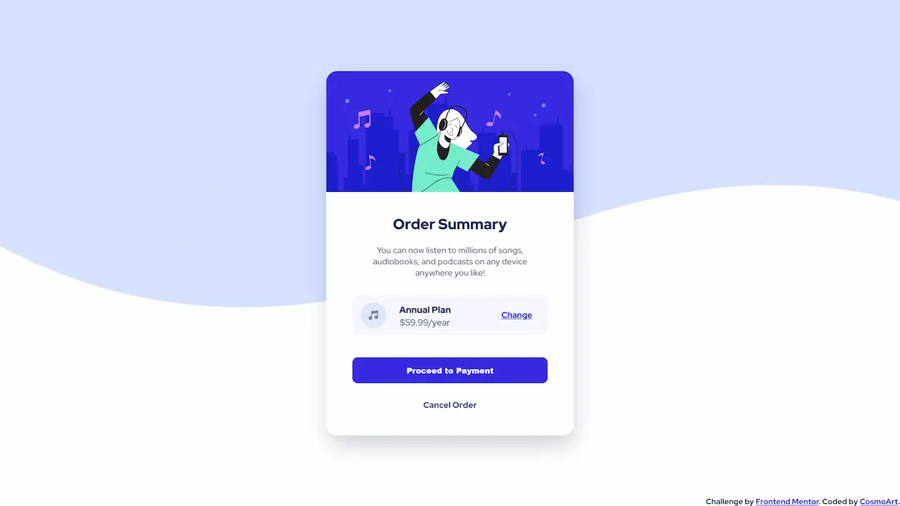
												Order summary
								</a>
				</td>
</tr>

<tr>
				<td>
								<a href=https://github.com/cosmoart/frontend-challenges/blob/main/src/pages/project/profile-card.html target="_blank" rel="noopener noreferrer">
												
												Profile card
								</a>
				</td>
				<td>
								<a href=https://github.com/cosmoart/frontend-challenges/blob/main/src/pages/project/qr-code.html target="_blank" rel="noopener noreferrer">
												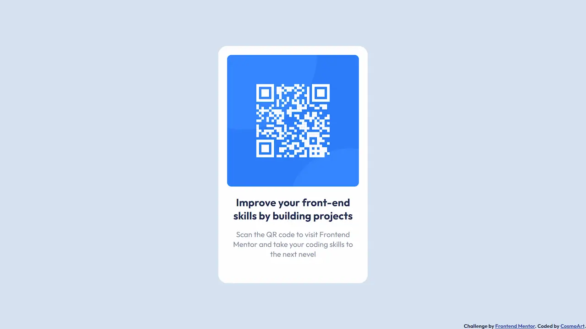
												Qr code
								</a>
				</td>
				<td>
								<a href=https://github.com/cosmoart/frontend-challenges/blob/main/src/pages/project/nft-preview-card.html target="_blank" rel="noopener noreferrer">
												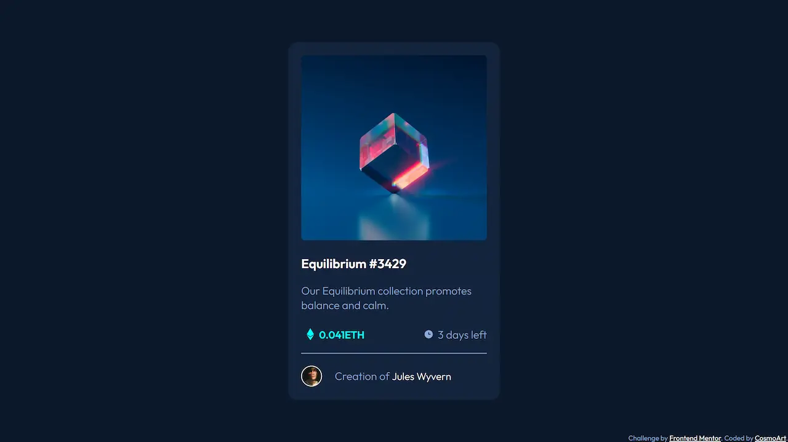
												Nft preview card
								</a>
				</td>
</tr>
</table>

<a href="#top">⬆ Back to top</a>

<!-- LICENSE -->
## License

Distributed under the MIT License. See `LICENSE.txt` for more information.

<a href="#top">⬆ Back to top</a>

<!-- CONTACT -->
## Contact

-   My website - [https://cosmoart.vercel.app](https://cosmoart.vercel.app)
-   Twitter - [@CosmoArt0](https://twitter.com/cosmoart0)
-   Instagram - [@cosmo_art0](https://www.instagram.com/cosmo_art0/)

<a href="#top">⬆ Back to top</a>
